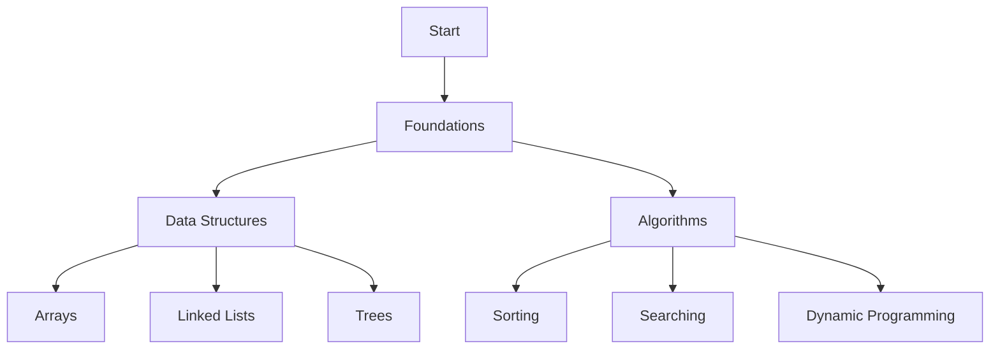

# 🚀 PathToRed - DSA Mastery Journey

---

## 🗺️ Roadmap to Red

A dedicated repository documenting my journey to mastering Data Structures and Algorithms through LeetCode challenges and systematic problem-solving practice.

## 📅 Learning Schedule

| Week | Focus Area       | Target Problems | Resources Used                          |
|------|------------------|-----------------|-----------------------------------------|
| 1    | Arrays & Strings | 20 problems     | Cracking the Coding Interview, LeetCode |
| 2    | Linked Lists     | 15 problems     | Grokking Algorithms, LeetCode           |
| 3    | Stacks & Queues  | 15 problems     | GeeksforGeeks, LeetCode                 |
| 4    | Trees & Graphs   | 20 problems     | Algorithms by CLRS, LeetCode            |
| 5    | Dynamic Programming | 25 problems | DP for Interviews, LeetCode             |
| 6    | System Design    | 10 problems     | Grokking System Design, LeetCode        |

## 📚 Key Resources

- **Books**: 
  - "Cracking the Coding Interview" by Gayle Laakmann McDowell
  - "Introduction to Algorithms" (CLRS)
  - "Grokking Algorithms" by Aditya Bhargava

- **Online Platforms**:
  - LeetCode (primary practice platform)
  - GeeksforGeeks (concept explanations)
  - CodeSignal (additional practice)
  - AlgoExpert (curated interview questions)

## 📊 Progress Tracker

| Metric                | Current Status | Goal       |
|-----------------------|----------------|------------|
| LeetCode Problems Solved | 125            | 500+       |
| Easy Problems         | 75             | 100%       |
| Medium Problems       | 40             | 80%        |
| Hard Problems         | 10             | 40%        |
| Contests Participated | 8              | 2/week     |

## 🧠 Problem-Solving Strategies

1. **Understand the Problem**: Clarify requirements and constraints
2. **Plan Approach**: Consider multiple solutions and trade-offs
3. **Pseudocode**: Write step-by-step plan before coding
4. **Implement**: Write clean, efficient code
5. **Test**: Validate with edge cases and sample inputs
6. **Optimize**: Refactor for time/space complexity
7. **Review**: Analyze mistakes and learn from them

## 📋 Personal Reflections

> "The journey to red belt status isn't about solving problems quickly, but about understanding deeply. Each problem I struggle with teaches me more than the ones I solve easily. I'm learning to embrace the difficulty as part of the growth process."

## 🤝 Community Engagement

- Participating in LeetCode discussions
- Sharing solutions on GitHub
- Attending weekly coding meetups
- Mentoring peers through their DSA journey

## 🎯 Milestones

- Complete 100 Days of Code challenge
- Solve 300 LeetCode problems
- Pass technical interviews at target companies
- Contribute to open-source projects using DSA skills

---

*Updated weekly with progress and insights. Join me on this journey to algorithmic excellence!*
